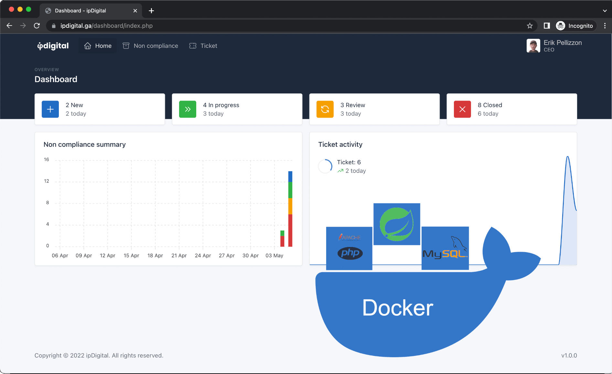
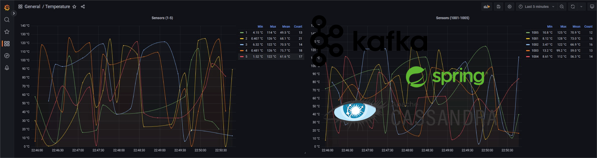
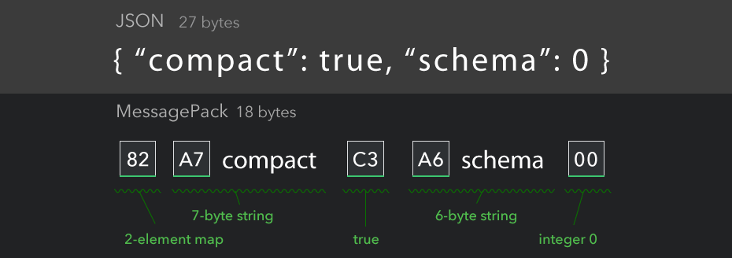
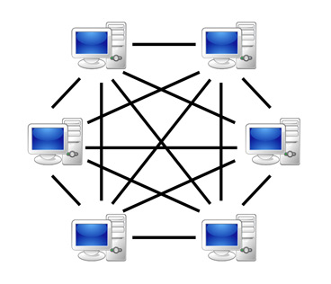
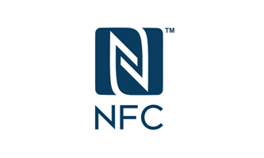

# 🔨 My projects

## [\[Java\] JDigital](https://github.com/ErikPelli/JDigital)

JDigital is a project based on [IpDigital](https://github.com/ErikPelli/IpDigital), an old school group project based on PHP, leaving its backend/frontend part intact and replacing the legacy PHP API that provides the core functionality with a Java Spring (Boot) API, without breaking compatibility with the previous one, making a transparent upgrade for its users.

The goal of the entire project was to create a system for managing nonconformities in an imaginary company, thus allowing tracking of how problems were resolved in the past and resolving them in the present through a simple but effective web interface, giving the employee sufficient freedom of choice on how to go about acting on a problem that has arisen.

## [\[Java\] BigMetric](https://github.com/ErikPelli/BigMetric)

BigMetric is a Proof of Concept to test a scalable network of temperature sensors located worldwide that collects time series data.
There is a middleware that handles the data collected from the sensors, filters it, processes it by converting it to a compatible format, and saves it to the database, written in Java Spring.

Grafana was chosen to display some graph on changes in sensor data over time. The tool takes data directly from the Cassandra cluster using some CQL (Cassandra Query Language) queries written for this project, over the timeframe considered.

## [\[Go\] MessagePack serializer in Go](https://github.com/ErikPelli/SimplyP2P)

S.B.O.R. is a modern and straightforward MessagePack serializer written completely in Go, without the use of code that use "unsafe" package and thus preserving the cross-compilation characteristics of the language.

The aim of the project is to make a library that balances the performance with the ease of use. Its code must be easy and understandable, and the tests must be adequate, with unit test code coverage greater than 95%.

## [\[Go\] SimplyP2P](https://github.com/ErikPelli/SimplyP2P)

SimplyP2P is a simple peer-to-peer network that synchronize a _common boolean state between all peers_ and show the current state in a GUI, with some buttons to change its value in all peers.

The reference value is the time expressed as UNIX timestamp: if the value is greater than that of the currently contained value, the status of current node is updated and it will be transmitted to the other connected nodes, otherwise the update will be discarded because it's considered obsolete.

## [\[Go\] Minecraft Light Server](https://github.com/ErikPelli/MinecraftLightServer)

Minecraft Light Server is a simple _multiplayer Minecraft server written entirely in Go_, which can help those who are making one to better understand how the basic things that compose it interact with each other.

It's very basic and its functions are very limited, but it was built following the specifications and understanding what other projects have done, which are written in the project readme file.

## [\[C\] SRIX4K Reader](https://github.com/ErikPelli/SRIX4K-Reader)

SRIX4K Reader is a program to read, modify and write SRIX4K and ST25TB04K NFC tags, which are contained in everyday products.
This project, unlike all the other similar ones on GitHub, follows all the guidelines imposed by the [ST datasheet](https://www.st.com/resource/en/datasheet/st25tb04k.pdf), including the rereading of the written data, to preserve the data integrity, and the division of the NFC tag's EEPROM into different logical zones with different permissions.

This program relies on **libnfc** library to interact with the NFC reader and the NFC tag, but due to its modularity, the library for the reader can be easily changed in the future.

## [\[Go\] Goombagram - suspended](https://github.com/GoombaGram/GoombaGram)

GoombaGram is a library written entirely in Go that interfaces directly with Telegram servers and acts as a Telegram client, thus allowing you to manage an account and automate actions.

Its development has been suspended, some parts have been developed but it's currently incomplete.

### [TL parser JSON](https://github.com/GoombaGram/TL-parser-JSON)
TL parser JSON is a parser linked to Goombagram that parse a Telegram _.tl scheme file_ and produce and output _JSON file_, which has the same format as those used by Telegram.

## [\[C\#\] McTazze](https://github.com/ErikPelli/McTazze)

McTazze is a program that generates random (but valid, thanks to the generation algorithm) McDonald's italian coffee promocode and insert them in some accounts registered on their website. Accounts are taken from a JSON file that contains emails and cookies of the account session.

However, McDonalds added a Google Captcha verification after 1 month, so I decided to release his full code for educational purposes.
Before that, it was able to completely fill the coupon slots of _500 accounts in about 2 minutes_.

### [McCafe Locations](https://github.com/ErikPelli/McCafe-Locations)
McCafe Locations is a simple Python script linked to McTazze and, starting from the files published on the McDonald's website, it compares the locations of restaurants and eliminates those that don't have a cafeteria, producing an output JSON file usable by mctazze.

## [\[Java\] MiZipGen](https://github.com/ErikPelli/MiZipGen)
MiZipGen is a Java library that calculates all the keys for the Mifare tag of the MiZip vending key. 

It's based on `https://github.com/iceman1001/proxmark3/blob/master/client/scripts/calc_mizip.lua`, but this is in clean Java code.

---

## [🔙 Home](/)

### © Copyright {{ site.time | date: '%Y' }}
